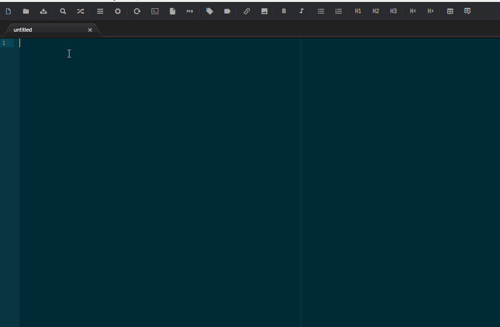

# power-editor package

Add some text editing features to atom:

- Duplicate Line Up
- Duplicate Line Down
- Switch with next word in list
- Switch with previous word in list

## Options:
- **useSmartDuplication:** enabling this feature, allow to increment or decrement any variable suffix, and or array acess by index: array[n]. Decrement will stop at 0. Variable suffix may have leading zeroes like: 022, or 0005.

## Usage:
**Duplicate Line:** duplicate allow to duplicate line(s) both up and down. If **smartDuplication** is true, the when you duplicate a word containing a number in the form wordN where N is the number, duplication increase or decrease N. **smartDuplication** also apply to expression of this type:
`varX = array[Y]`: here "X" and "Y", will increase or decreased according.  

**Switch word in list:** this function allow to swap word in a list of comma separated values, so for example: `var1, var2` become: `var2, var1` and vice-versa.
